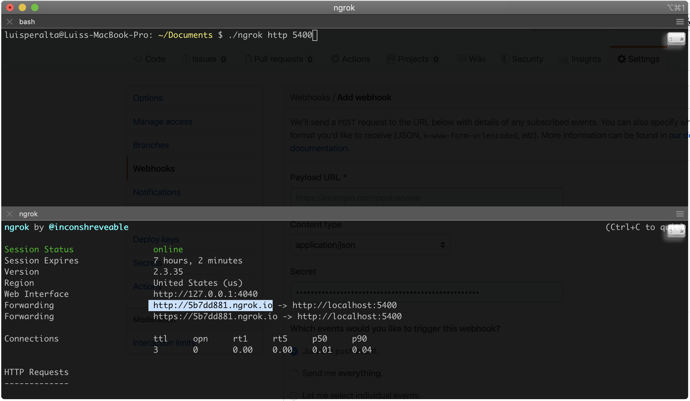
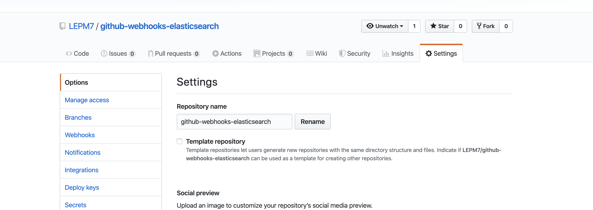
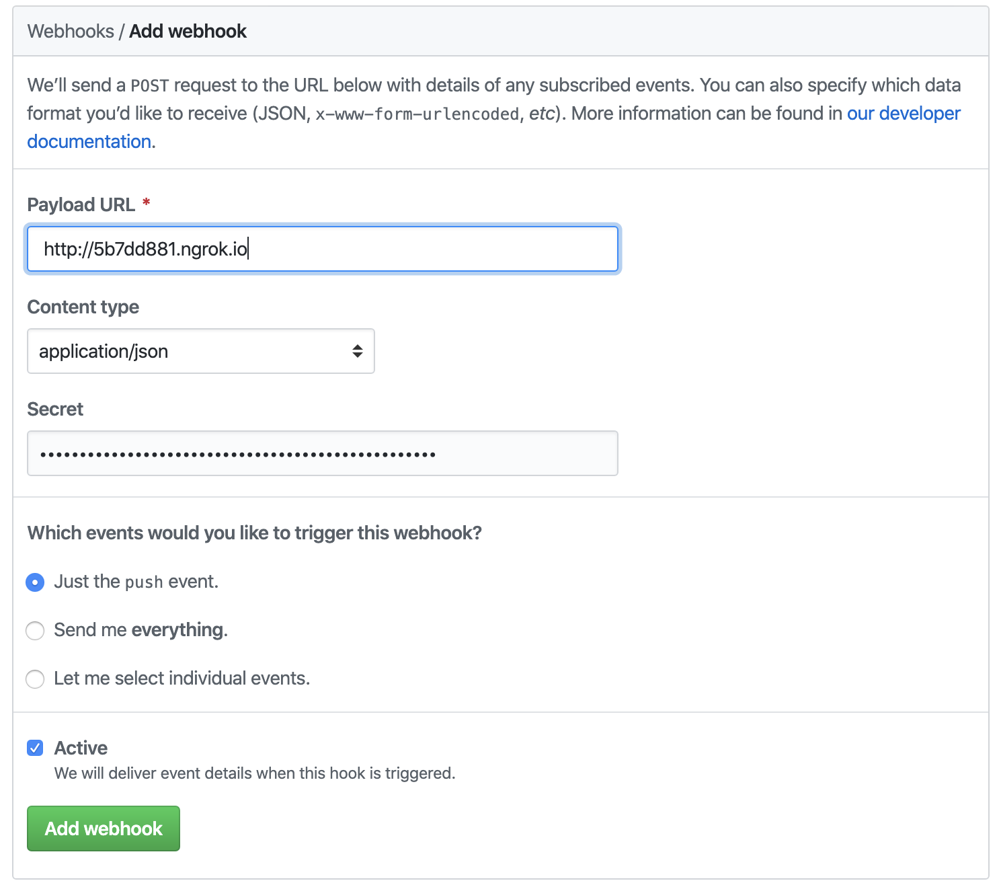

# github-webhooks-elasticsearch

## Requirements
- [Docker and docker-compose](https://docs.docker.com/get-docker/)
- [Ngrok](https://dashboard.ngrok.com/get-started)

### Configuration
1. Run grok and grab the forwarding url

2. Go to webhooks from your repo and click on create webhook

3. Generate a secret token and paste the url from grok like this

#### Start

1. Docker - `docker-compose up -d`
2. ngrok for local machine `./ngrok http 5400` <- Configurated port for logstash

#### Stop

`docker-compose down`

## Useful links
- `https://developer.github.com/webhooks/`
- `https://developer.github.com/webhooks/configuring/`
